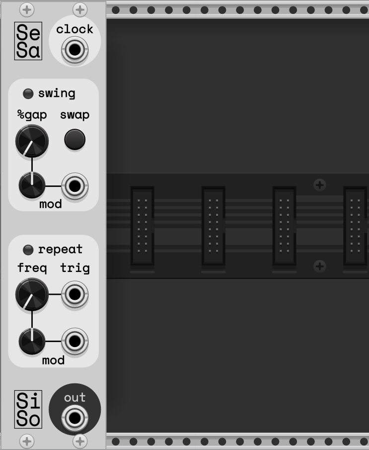
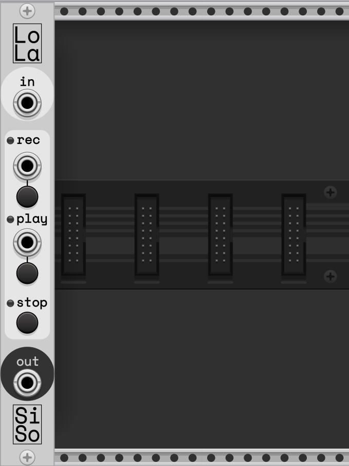
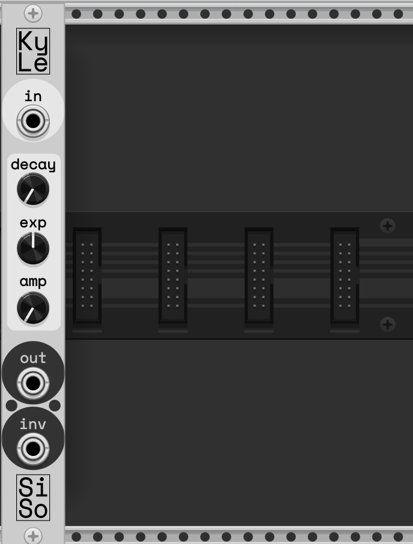

# Silly Sounds - VCV Rack 2 Eurorack Modules

Silly Sounds is a collection of eurorack modules I thought would be neat to make while progressively learning more about audio programming and the VCV Rack developer environment. The development files are kept clean and commented, so feel free to dive in to get a better idea on what makes each module tick!

## Sesame > Clock Swing and Repeat

I/O
- `clock`: A clock signal input (traditionally a gate but blips should work too!)
- `out`: Modulated clock signal output

Swing
- `%gap`: The percentage difference in time between clock gaps (eg. 20% would make the gaps between rises 20% longer, then 20% shorter). Essentially, the higher the percentage the more *swing*
- `swap`: Swap which beat is even and odd (eg. go from 1-2---3-4 to 1---2-3---4)
- `mod`: Use the input provided to modulate `%gap` in real time, adjusting the level of positive or negative impact through the knob

Repeat
- `freq`: The amount of repeats that should occur when activated, dividing each beat into *n* subdivisions
- `trig`: Input to trigger repeat (hint: if you would like to trigger every clock rise, put a constant signal of 10V into this input, or just put in your input clock signal!)
- `mod`: Use the input provided to modulate `%gap` in real time, adjusting the level of positive or negative impact through the knob

## Lola > In-Line Sampler

I/O
- `in`: Any signal input
- `out`: Output of your sample playback. If no sample is currently being played, this acts as a passthrough of your original signal input

Repeater
- `rec`: Input and button to trigger the start/end of a recording session. Trigger once to begin recording and trigger again to end. Has a limit of 4s
- `play`: Input and button to playback the recorded sample from your input. Pressing this while already playing a sample will restart playback
- `stop`: Button to stop sample playback

## Kyle > Envelope Detector for Sidechaining

I/O
- `in`: Any input signal you would like an envelope for
- `out`: Output envelope of the input signal
- `inv`: Inverse output of the envelope, very useful for sidechaining!

Envelope Settings
- `decay`: Constant value to decay the signal by each sample step
- `exp`: Exponential curve to adjust how the decay is applied (positive makes it curve down and negative makes it curve up)
- `amp`: Amplify the output, multiplicatively scaling the output

NOTE: For workflow, I recommend putting `in` and `out` into a scope, and playing around with the parameters until you create an envelope you're happy with

## Questions/Issues?

Raise a ticket here, check out my [Personal GitHub Pages Site](https://loparcog.github.io/) with notes on each module and their development, or shoot me a message on [Discord](https://discordapp.com/users/196388136656437250)!